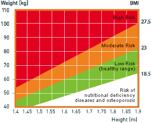

## Introduction

The Body Mass Index (BMI) is a measuremeant of relative size based on the mass and height of an individual.

The BMI for a person is defined as their body mass divided by the square of their height with the value universally being given in units of kg/m^2 

### $$BMI = \frac{mass_{kg}}{height_m^2}$$

---

## Know Your Risks

A frequent use of the BMI is to assess how much an individual's body weight departs from what is normal or desirable for a person of his or her height.

A BMI value of 23 and above indicates that your weight is outside of the healthy weight range for your height.




I have developed a BMI calculator to faciliate the computation.

[Click here to calculate your BMI to know your risks.](https://ksgoh.shinyapps.io/Project/)

--- &radio

## Quiz 1

What is the BMI for Mr X who is 70 Kg and 1.75m?

1. 20.7
2. 21.5
3. _22.9_
4. 23.0

*** .hint

### $$BMI = \frac{mass_{kg}}{height_m^2}$$

*** .explanation

Mr X's BMI is 22.9


```r
    w <- 70
    h <- 1.75
    BMI <- w / h^2
    round (BMI,1)
```

```
## [1] 22.9
```

--- &radio

## Quiz 2

What is the desirable BMI range?

1. below 18.5
2. _18.5 - 22.9_
3. 23 - 27.5
4. above 27.5

*** .hint

Cannot be too fat or too thin

*** .explanation

18.5 - 22.9 is the low risk healthy BMI range. 
